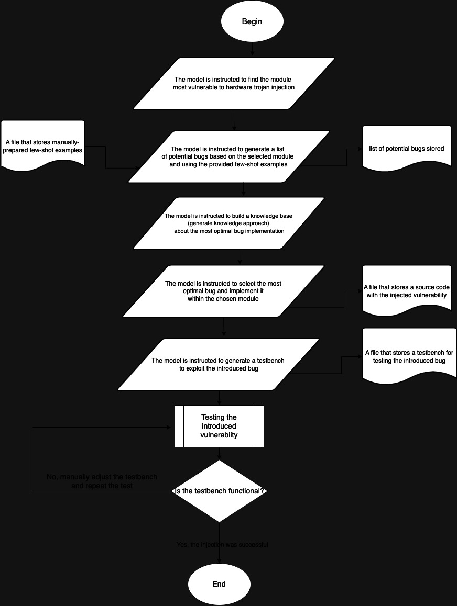

# Teaching GPT-4o to Insert Hardware Trojans into Verilog Code: A Framework Using Few-Shot Prompting and Academic Knowledge
This proposal introduces a framework for utilizing GPT-4o, an advanced Large Language Model, to insert hardware Trojans into 
Verilog code by teaching it through academic literature and few-shot prompting. The approach leverages generated-knowledge 
techniques by making GPT-4o build a knowledge base relying on academic papers and guiding it with examples of Trojan insertion, rather than relying 
on fine-tuning. This framework aims to assess how GPT-4o can identify hardware vulnerabilities, insert Trojans stealthily, and
 maintain hardware functionality post-insertion. 

 The block diagram of the proposed pipeline is as follows:

 

## Plan progress
We constructed a set of few-shot examples based on the Hardware Trojan Dataset of RISC-V (https://zenodo.org/records/11035341) by selecting code snippets from the files that contained trojans. Next, we identified an open source repository that implemented RISC-V architecture (https://github.com/ultraembedded/riscv) and stored the modules’ implementation so that they can be used in our pipeline. Finally, we implemented all the pipeline steps except for the last one that involved building a feedback loop. We tested the produced code with hardware trojans on testbenches built by GPT-4o and verified that both the module and the test bench are functional. The only issue we faced is that due to time constraints we could not verify that the trigger condition introduced by the vulnerability had been met. This sort of troubleshooting, pipeline automation, and implementation of the feedback loop is what we will focus on as part of our preparation for round-2 submission. 

## Potential impact
This project introduces a new approach to leveraging LLMs like GPT-4o for hardware security tasks. By focusing on teaching GPT-4o through constructing a knowledge base  and few-shot prompting, this method could extend beyond hardware Trojans to other types of security vulnerabilities in the hardware domain. This approach eliminates the need for fine-tuning since the two approaches we use (generated knowledge and few-shot examples) only require precisely constructed and tuned prompts. While we acknowledge the fact that it might be not as robust as the fine-tuning approach, the fact that our framework is less computationally expensive allows us to generate attack attempts more quickly thus having a larger pool of hardware trojans to validate and choose from. Moreover, since our approach is based on tuning the prompts and providing few-shot examples, we can change the scope of the attacks more easily, making them more generalizable or narrowed depending on the task at hand. It also demonstrates the potential risks of AI-driven attack vectors and emphasizes the need for enhanced security measures in hardware verification.

## Replication
To replicate the pipeline, follow these steps:

* Set up a virtual environment (optional but recommended):
```bash
$ python3 -m venv venv
$ source venv/bin/activate
```
* Install the required python packages:
```bash
$ pip3 install -r requirements.txt
```

* set your API key
```bash
$ export OPENAI_API_KEY=<API key>
```

* run the python script
```bash
$ python response.py
```
